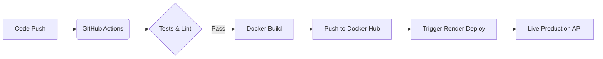

# 📚 Books API (Libris_r1)

[](https://github.com/r-Shivansh01/Libris_r1/actions/workflows/ci-cd.yml)
[](https://nodejs.org)
[](https://www.docker.com/)
[](https://opensource.org/licenses/ISC)
[](https://books-api-latest.onrender.com/health)

A production-ready **Node.js REST API** for managing a book collection. This project demonstrates a complete DevOps lifecycle, featuring containerization, comprehensive testing, and a fully automated CI/CD pipeline.

🚀 **Live API:** [https://books-api-latest.onrender.com](https://books-api-latest.onrender.com/books)

---

## 🛠 Features

- **RESTful Architecture:** Complete CRUD operations for a book library.
- **Robust Testing:** Unit and integration tests using **Jest** and **Supertest**.
- **Code Quality:** Linting with **ESLint** to maintain high standards.
- **Containerization:** **Docker** multi-stage builds for slim, secure production images.
- **CI/CD Pipeline:** Automated via **GitHub Actions** for seamless delivery.
- **Auto-Deployment:** Integrated with **Render** via secure deploy hooks.

---

## 🏗 Project Architecture



---

## 🚀 Getting Started

### Prerequisites
- Node.js (v18+)
- Docker (optional, for containerized execution)

### Local Development
```bash
# Navigate to the project folder
cd books-api

# Install dependencies
npm install

# Run in development mode (with nodemon)
npm run dev
```

### Running with Docker
```bash
docker build -t books-api .
docker run -p 3000:3000 books-api
```

---

## 🛣 API Endpoints

| Method | Endpoint | Description |
| :--- | :--- | :--- |
| `GET` | `/health` | Service health status & timestamp |
| `GET` | `/books` | Retrieve all books in the collection |
| `GET` | `/books/:id` | Get details of a specific book |
| `POST` | `/books` | Add a new book to the library |
| `PUT` | `/books/:id` | Update an existing book's information |
| `DELETE` | `/books/:id` | Remove a book from the collection |

---

## 🧪 DevOps & CI/CD Details

### Pipeline Workflow
1. **Lint & Test:** Runs ESLint and Jest suite. Uploads coverage reports as artifacts.
2. **Build & Push:** Uses Docker Buildx to build the image with `latest` and `SHA` tags.
3. **Deploy:** Executes a POST request to Render's deploy hook for instant updates.

### Security Best Practices
- **Non-root user:** Container runs as `appuser` for improved security.
- **Multi-stage build:** Keeps the production image footprint minimal (< 200MB).
- **GitHub Secrets:** All credentials (DockerHub, Render Hooks) are securely managed.

---

## 📝 License
This project is licensed under the [ISC License](./LICENSE).
